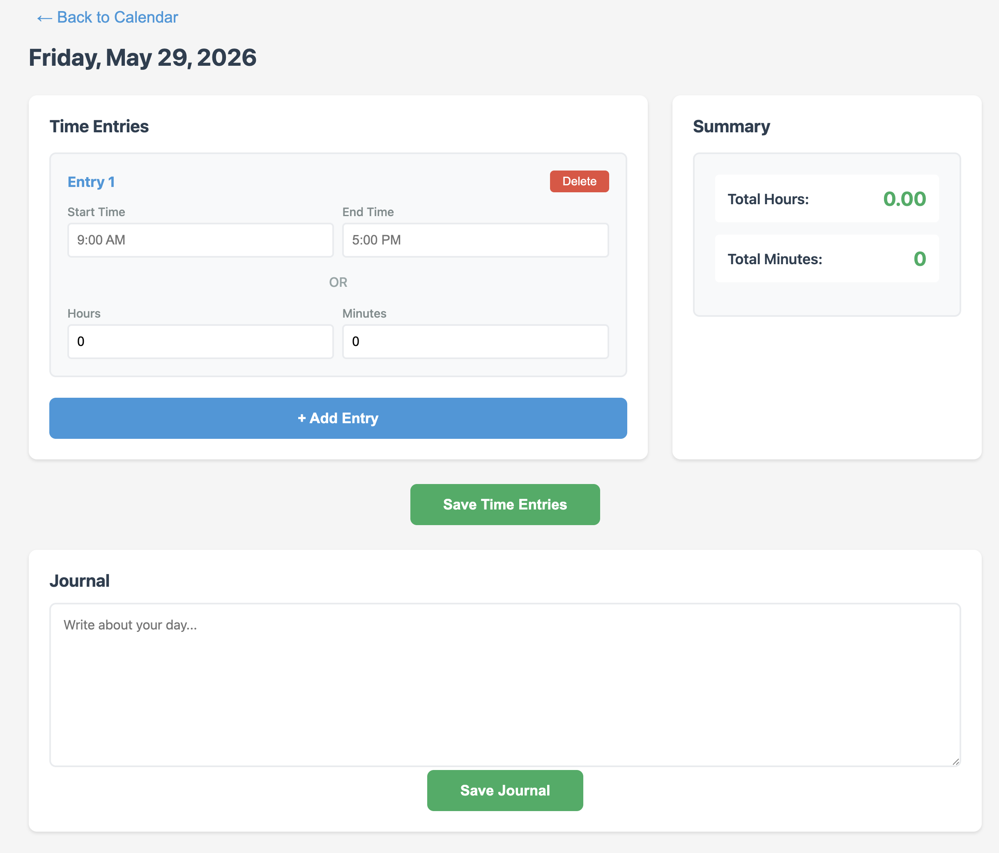

# Time Tracker

A simple, local time tracking web application with calendar interface. Built with FastAPI, SQLite, and vanilla JavaScript.



## Features

- **Calendar View**: Monthly calendar showing all your logged hours
- **Time Entry**: Click any day to log multiple time entries
- **Flexible Input**: Enter time as ranges (9:00 AM - 5:00 PM) or direct hours (8.0)
- **Real-time Calculation**: Automatic calculation of total hours and minutes
- **Local Storage**: All data stored in SQLite database
- **Docker Ready**: Easy deployment with Docker Compose

## Quick Start with Docker

```bash
# Build and start the application
docker-compose up --build

# Access the app at http://localhost:8000

## Usage

1. **View Calendar**: See your monthly time entries at a glance
2. **Navigate Months**: Use arrow buttons to move between months
3. **Add Entries**: Click any day to add time entries
4. **Enter Time**:
   - Use time ranges: "9:00 AM" to "5:00 PM"
   - Or enter direct hours: "8.0"
5. **Multiple Entries**: Add multiple entries per day
6. **Save**: Click save to store entries in the database
7. **Go Back**: Use the back arrow to return to calendar

## Sample Data

The application comes pre-populated with sample data from October 25-31, 2024 to help you get started.

## Technology Stack

- **Backend**: FastAPI with uvicorn
- **Database**: SQLite
- **Frontend**: Vanilla JavaScript, HTML5, CSS3
- **Package Manager**: uv
- **Containerization**: Docker & Docker Compose

## Project Structure


time-tracker/
├── main.py              # FastAPI application
├── database.py          # Database operations
├── pyproject.toml       # Project dependencies
├── Dockerfile           # Docker image definition
├── docker-compose.yml   # Docker Compose configuration
└── static/
    ├── index.html       # Frontend HTML
    ├── styles.css       # Styling
    └── app.js           # Frontend logic


## API Endpoints

- `GET /` - Serve the web application
- `GET /api/entries/{date}` - Get entries for a specific date
- `POST /api/entries` - Save entries for a date
- `GET /api/entries/month/{year}/{month}` - Get month summary

## Development

To stop the Docker container:

```bash
docker-compose down
```

To rebuild after changes:

```bash
docker-compose up --build
```

## License

MIT
